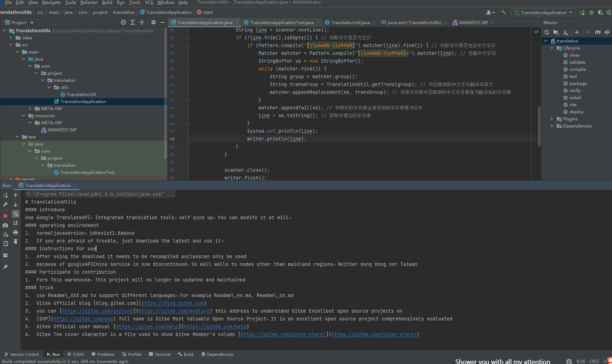

# TranslationUtils

#### 介绍
利用谷歌翻译API，集成的翻译工具，需要的自取，自己可随意修改。

#### 运行环境

1.  正常java版本即可，jdk在1.8以上
2.  怕麻烦就直接下载最新即可用。

#### 使用说明

1.  使用下载后需要重新编译为class才可使用
2.  因为谷歌API现在已经停止中国服务了，所以墙墙到除大陆地区以外的节点，香港台湾也不行

#### 参与贡献

1.  Fork 本仓库，后面不再对此项目进行更新和维护

例如：

#### 特技

1.  使用 Readme\_XXX.md 来支持不同的语言，例如 Readme\_en.md, Readme\_zh.md
2.  Gitee 官方博客 [blog.gitee.com](https://blog.gitee.com)
3.  你可以 [https://gitee.com/explore](https://gitee.com/explore) 这个地址来了解 Gitee 上的优秀开源项目
4.  [GVP](https://gitee.com/gvp) 全称是 Gitee 最有价值开源项目，是综合评定出的优秀开源项目
5.  Gitee 官方提供的使用手册 [https://gitee.com/help](https://gitee.com/help)
6.  Gitee 封面人物是一档用来展示 Gitee 会员风采的栏目 [https://gitee.com/gitee-stars/](https://gitee.com/gitee-stars/)
